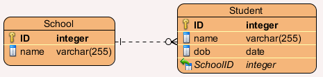

# Welcome to DB

## Here is the app stack we've been using:

  - Client-side: HTML/CSS/JavaScript
  - Server-side: Node.js 
  - Data-store: local FS, JSON

## What are the advantages/disadvantages of using each technology? 

| Technology | Strengths | Weaknesses |
| ------ |  ------ | ------ |
| **HTML/CSS/javaScript** | WEB!, browsers are everywhere, easy GUI design | no native code, relying on multi-vendor browsers, security |
| **Node** | scales to many users very quickly, written in javaScript | Not good for complex server-side calculations  |
| **local FS, JSON** | fast access | not very robust, simultaneous access by multiple people?, ensuring data doesn't get corrupted?, what if we need to move data to another server?, what if we need to split our data into smaller chunks?, what if we need to share only small parts of our data with other clients/servers?, what if the computer crashes in the middle of writing? | 
## A Database is a more robust alternative to using a local FS data-store.

Robust means that database tools have been specifically developed to make reading, writing, and deleting from large files easy and reliable.

### There are many popular models of Database architecture:

#### Relational
Relational databases represent data in the form of tables. Think .csv without the hassle. We're going to focus on this type of database.

- **Example:** MySQL represents data in tables and rows.

**More info:** http://www.iheavy.com/2011/07/05/relational-database-what-is-it-and-why-is-it-important/

#### Non-relational
Non-relational databases represent do not represent data in a table. There are many forms of non-relational datastores.

- **Example 1:** MongoDB represents data as collections of JSON documents
- **Example 2:** Our current local FS with JSON data-store.

## Data Modelling
Designing an app requires you to keep track of lots of data. How will you model that data? 

### An ERD diagram represents your data model.

#### Conceptual
- Draw a big picture idea.

#### Logical
- Split your big picture into small parts.
 

#### Physical
- Identify how your small parts will be represented. 
- How will your parts connect to each other?
 

## Draw a "Physical" ERD for the following scenarios:

Topics:

  - Drawing basic ERD Diagrams
      - relating tables via id's (two-way )
  - Relating tables to JSON
  - Schema

  - http://www.visual-paradigm.com/features/database-design/#erd
  - http://www.visual-paradigm.com/VPGallery/datamodeling/EntityRelationshipDiagram.html
